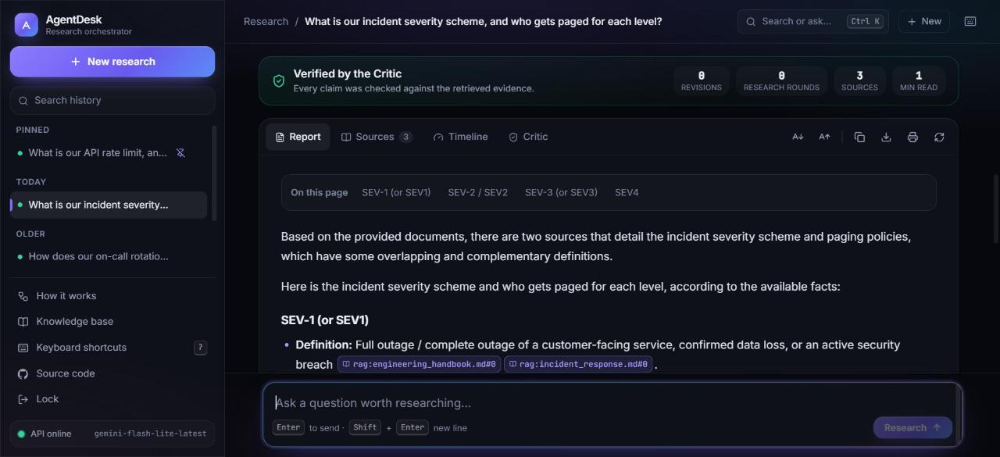
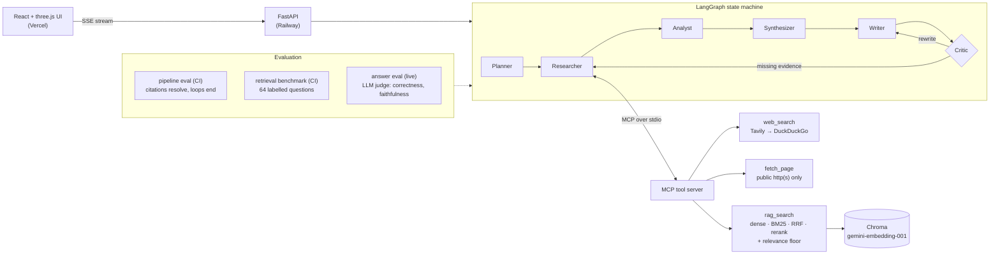

# AgentDesk — Multi-Agent Research Assistant That Shows Its Sources

[](https://github.com/rahuldabola/agentdesk/actions/workflows/tests.yml)
[](LICENSE)
[](pyproject.toml)

**Ask a question. Five AI agents plan, research, analyse, write and fact-check a report, and
every sentence in it links to the exact document or web page it came from.**

**🔗 Try it live:** [agentdesk-research.vercel.app](https://agentdesk-research.vercel.app)
&nbsp;·&nbsp; password: `mjSqEPp14EMF` &nbsp;·&nbsp;
[API](https://agentdesk-production-9e6c.up.railway.app)

<p align="center">
  
</p>
<p align="center"><sub>A finished run: verified by the Critic, with every claim carrying a citation chip.</sub></p>

> New here? Read **[What it does](#what-it-does)**, then **[How it works](#how-it-works)**.
> Want to run it? Jump to **[Quick start](#quick-start)**.

---

## What it does

A single chatbot answering a research question tends to either make things up or give a vague
answer with no sources. AgentDesk avoids both:

1. A **Planner** classifies your question, lists what a complete answer must contain, and
   splits it into smaller research tasks.
2. A **Researcher** looks each one up in a private knowledge base (RAG) and on the web.
3. An **Analyst** pulls out individual facts, each tied to the source it came from.
4. A **Synthesizer** groups the facts into themes and flags where sources disagree.
5. A **Writer** drafts the report in a shape that suits the question, using only those facts.
6. A **Critic** checks the draft against the sources and the Planner's criteria. If a claim is
   unsupported or something is missing it sends the draft back, either for a **rewrite** or, if
   evidence is missing, for **more research**.

You get a report like this (shortened):

```
Q: What is our API rate limit?

Each API key is limited to 1,000 requests per minute [rag:api_policies.md#0].

Sources
  [rag:api_policies.md#0]  api_policies.md, chunk 0
```

Every `[source_id]` resolves to a real file chunk or URL, so the report can be audited.

## Results at a glance

| What was measured | Result |
| --- | --- |
| Finding the right document (64 labelled questions) | **97%** Recall@4 (the right chunk is in the top 4) |
| Refusing off-topic questions | **0% → 100%**, found and fixed by the benchmark |
| Offline tests | **166 tests, 92% coverage**, no API keys needed |
| Real production bugs found by deploying | **2**, both fixed with regression tests |
| Answer quality (26 questions, LLM judge) | **0.92** correctness · **0.95** faithfulness · **100%** no made-up answers to unanswerable questions · [details](#answer-quality-llm-judge) |
| Public benchmark (BEIR SciFact) | **0.70** nDCG@10 with hybrid search on 300 expert-labelled claims; our BM25 reproduces the published figure · [details](#public-benchmark-beir-scifact) |

**Stack:** LangGraph · MCP (real stdio client/server) · FastAPI · Gemini · Chroma · BM25 ·
React + three.js · Docker · GitHub Actions · Railway + Vercel

## How it works



| Agent | Job | Guardrail |
| --- | --- | --- |
| **Planner** | Classifies the question, sets checkable success criteria, breaks it into subtasks; decides whether to use the knowledge base, the web, or both | Output is a forced function call, never free text |
| **Researcher** | Two concurrent lanes over one MCP session: the internal lane searches the knowledge base and rewords a query that found nothing (once); the web lane searches, then reads the top pages in full via `fetch_page`. Registers each passage under a stable `source_id` | Owns the source registry. A failed rewrite or page falls back to the plain result. `fetch_page` refuses non-public addresses and re-checks every redirect. Tunable with `AGENTDESK_FETCH_PAGES` (0 = off), `AGENTDESK_FETCH_MAX_CHARS`, `AGENTDESK_QUERY_REWRITE` |
| **Analyst** | Extracts atomic facts (typed: number, policy, procedure, definition, claim), each bound to a `source_id` | Drops any fact citing an id that was never retrieved |
| **Synthesizer** | Groups facts into themes, flags conflicts (including internal vs external practice) and gaps | Refers to facts by index only; a fact it forgets to place is kept, never dropped |
| **Writer** | Drafts the report from the themed facts in a shape chosen by question type (comparison table, steps, risk review, direct answer, brief), citing inline | Can only use what the Analyst passed on |
| **Critic** | Verifies the draft against the evidence, the success criteria and itself, and returns pass/revise | A "pass" cannot override uncovered criteria or contradictions. Routes "badly written" to the Writer and "missing evidence" to the Researcher; both loops are capped |

Two design choices do most of the work:

1. **Citations are structural, not stylistic.** The Analyst may only cite ids that exist in the
   Researcher's registry, and the API returns the bibliography of ids the *finished report*
   actually contains. A reader gets what they can verify, not what the Writer was offered.
2. **The self-correction loop can gather new evidence.** A draft can fail because the Writer
   overreached or because the evidence was never retrieved. Only the first is fixable by
   rewriting, so the Critic sends the two failures to different places.

State flows through a `langgraph.graph.StateGraph`. `research_notes` and `trace` carry reducers,
so a second research round **accumulates** evidence instead of overwriting the first.

## Quick start

```bash
python -m venv .venv
.venv\Scripts\activate            # or: source .venv/bin/activate
pip install -r requirements.txt
cp .env.example .env              # add GEMINI_API_KEY (free at aistudio.google.com/apikey)

python -m scripts.ingest_docs     # embed the sample knowledge base
python -m scripts.run_demo "What is our on-call rotation and how does it compare to typical SRE practice?"
```

Run the API and the web UI:

```bash
uvicorn app.main:app --reload                       # terminal 1: API on :8000
cd frontend && npm install
echo "VITE_API_BASE_URL=http://localhost:8000" > .env.local
npm run dev                                         # terminal 2: UI
```

Or with Docker: `docker build -t agentdesk . && docker run -p 8000:8000 --env-file .env agentdesk`

<details>
<summary><b>Sample CLI output and API usage</b></summary>

```
=== TRACE ===
  planner            4ms  2 subtasks, use_rag=True, use_web=True
  researcher        96ms  initial: 7 notes from 2 subtask(s), 7 source(s)
  analyst            3ms  extracted 7 facts from 7 notes
  writer             3ms  drafted 823 chars from 7 facts (revision 0)
  critic             2ms  pass (0 flagged claims)

=== REPORT (passed) ===
On-call is a weekly rotation starting Monday [rag:engineering_handbook.md#1]. This matches
the rotation length most commonly recommended for SRE teams [web:1].

=== CITATIONS (3) ===
  [rag:engineering_handbook.md#1] engineering_handbook.md chunk 1
  [web:1] https://sre.google/workbook/on-call/
```

```bash
curl -X POST localhost:8000/api/report -H 'content-type: application/json' \
     -d '{"question": "What is our API rate limit?"}'
```

```jsonc
{
  "status": "passed",                  // or "revision_limit_reached"
  "report": "Each API key is limited to 1,000 requests per minute [rag:api_policies.md#0].",
  "citations": [
    {"source_id": "rag:api_policies.md#0", "type": "rag", "file": "api_policies.md",
     "chunk_index": 0, "score": 0.71}
  ],
  "revisions": 0,
  "research_rounds": 0,
  "critic": {"verdict": "pass", "feedback": "...", "unsupported_claims": []},
  "trace": [{"node": "planner", "detail": "2 subtasks, use_rag=True, use_web=False",
             "elapsed_ms": 812.4}]
}
```

For long runs, stream progress instead of holding a blank connection open:

```bash
curl -N -X POST localhost:8000/api/report/stream -H 'content-type: application/json' \
     -d '{"question": "What is our incident severity scheme?"}'
```

```
event: progress
data: {"node": "planner", "detail": "3 subtasks, use_rag=True, use_web=False", "elapsed_ms": 812.4}

event: report
data: {"status": "passed", "report": "...", "citations": [...], "trace": [...]}
```

A failure mid-stream arrives as a terminal `error` event rather than a severed connection.
</details>

---

## Design deep-dives

### Why MCP instead of calling the tools directly

The Researcher does not call Python functions. It opens a `ClientSession` against
`app/mcp/server.py` — a separate process, launched as `python -m app.mcp.server`, speaking
JSON-RPC over stdio with declared, schema-typed tools. That is the point of MCP: the tool server
is independently callable by any MCP client, not just this codebase.

One session is opened per question and reused for every call. Opening it per call — as the first
version of this project did — meant a fresh subprocess, handshake, and Chroma client for each of
the (subtasks × tools) calls a single question produces.

### Why RAG instead of stuffing docs into the prompt

The sample corpus in `data/sample_docs/` is 24 internal-style documents (~30KB, 55 chunks):
on-call, incident response, SRE practice, deployment, access control, API policy and error codes,
webhooks, observability, backups, secrets, billing, privacy, and more. The documents overlap on
purpose (several mention "30 days", "rotation", "Tier 1"), so retrieval has to tell them apart
rather than just return whatever exists.

`app/rag/ingest.py` chunks markdown (800 chars, 150 overlap), embeds with Gemini
`gemini-embedding-001`, and upserts into a persistent Chroma collection configured for
**cosine** distance. Re-ingesting a file deletes its previous chunks first, so deleting content
from a source document actually removes it from retrieval.

`app/rag/retriever.py` runs a configurable pipeline:

1. **Candidates**: dense top-20 from Chroma and/or BM25 top-20 (`app/rag/bm25.py`, an Okapi
   index built from the same chunks, with a tokenizer that keeps identifiers like `AUTH-1003`
   whole).
2. **Fusion** (hybrid mode): reciprocal rank fusion, which needs no calibration between cosine
   distances and BM25 scores.
3. **Reranking** (optional): a local ONNX cross-encoder (`app/rag/rerank.py`, via fastembed)
   reorders the candidates.
4. **Relevance floor** (`AGENTDESK_MAX_DISTANCE`, default 0.40): anything whose cosine distance
   exceeds it is dropped, in every mode. Top-k alone is not a relevance test: an off-topic
   question still returns k chunks, which the Analyst would then treat as evidence.

The default is plain dense retrieval with the floor at 0.40. Both choices come from the
retrieval benchmark below, not from habit.

## Reliability

| Concern | How it is handled |
| --- | --- |
| Transient 429s / 5xx / connection drops | `app/util/retry.py` — jittered exponential backoff on both Gemini generation and embedding calls, honoring the API's own `Retry-After` hint on rate limits. 4xx is never retried. |
| A search provider failing | Tavily errors fall through to DuckDuckGo; total failure returns an empty result set plus the reason, and the run continues with whatever the other tool found. |
| A tool returning something unparseable | `ToolError`, surfaced — never silently treated as "no results". |
| Missing API keys | `ConfigurationError` with the fix in the message, raised before any network call. |
| Errors reaching the API | Typed handlers: `ConfigurationError` → 500, everything else in the `AgentDeskError` tree → 502 with a structured body. No stack traces to callers. |
| A report that never passed critique | Returned with `status: "revision_limit_reached"` and the Critic's flagged claims, so a caller can tell a verified report from an unverified one. |
| Runaway loops | Both the rewrite and research loops are separately capped; `test_the_graph_terminates_when_the_critic_never_passes` proves termination. |
| Observability | Every node emits a structured trace entry (`node`, `detail`, `elapsed_ms`) plus a log line, returned in the API response. |

## Tech stack

| Layer | Choice | Why |
| --- | --- | --- |
| Orchestration | LangGraph (`app/graph.py`) | An explicit state machine with reducers and conditional edges, not a fixed chain |
| LLM | Gemini (`app/llm/gemini_client.py`) | Every decision point (plan, extract facts, critique) is a forced function call via `FunctionCallingConfig(mode="ANY")`, so nothing is parsed from free text |
| Retrieval | `gemini-embedding-001` + Chroma (cosine), BM25, rank fusion, optional ONNX cross-encoder | All of them benchmarked against each other; the winner is the default |
| Tools | `mcp` SDK, real client/server over stdio | The tool server is callable by any MCP client, not just this repo |
| API | FastAPI (`app/main.py`) | `POST /api/report` and an SSE `POST /api/report/stream`; optional shared-password gate |
| Frontend | Vite + React + three.js (`frontend/`) | Live 3D view of the agents, step-by-step replay, tabbed report with hoverable citation chips, Markdown/PDF export, local history, command palette |
| Quality gates | ruff, pytest (85% floor), stdio smoke test, offline eval, retrieval benchmark | Each has pass/fail thresholds, enforced in CI on Python 3.11 and 3.12 |
| Deploy | Docker, Railway (API), Vercel (UI) | Branch-protected `master`, required checks, secret scanning, Dependabot |

## Tests

```bash
pytest                        # 166 tests, fully offline, no API keys, no cost
pytest --cov=app              # 92% line coverage
ruff check . && ruff format --check .
```

Only the three true edges are mocked — the Gemini generation API, the Gemini embeddings API, and
outbound HTTP (`tests/doubles.py`). **Chroma, LangGraph, and the MCP protocol all run for real.**

Worth singling out:

- **`tests/test_research_pipeline.py`** drives real Chroma → real MCP tool → real JSON-RPC →
  Researcher, and asserts a multi-paragraph passage arrives intact. This is a regression guard:
  an earlier version serialised passages to `[source_id] text` and reparsed them by splitting on
  blank lines, which silently truncated every markdown passage at its first blank line — 782
  characters retrieved, 22 delivered. Unit tests passed the whole time, because they tested each
  side of the seam and nothing tested the seam.
- **`tests/test_mcp_protocol_integration.py`** exercises the initialize handshake, the declared
  tool schemas, and concurrent calls sharing one session, over the SDK's in-memory transport.
- **`scripts/check_mcp_server.py`** (run in CI) covers what that transport skips: that
  `python -m app.mcp.server` really starts as its own process and completes a stdio handshake.
- **`tests/test_graph_flow.py`** tests the graph as the state machine it is — each routing
  branch, both loops, reducer accumulation, and termination under a Critic that never passes.

## Evaluation

`eval/eval_set.json` holds 6 questions spanning RAG-only, web-only, and both-needed cases.

```bash
python -m eval.run_eval --offline --check   # deterministic, free, runs in CI
python -m eval.run_eval --live              # real Gemini + embeddings; costs money
```

**Offline** substitutes a scripted stub (`eval/stub_model.py`) for Gemini and the
embedding/search APIs, while running the real graph, the real MCP protocol, and real Chroma.
`--check` fails the build if a pipeline invariant regresses, which makes the eval a test rather
than a report nobody reruns. Raw rows: [`eval/results_offline.json`](eval/results_offline.json).

<!-- eval:offline:start -->
_Offline run, 6 cases, recorded 2026-09-04._

| Metric | Result | Measures |
| --- | --- | --- |
| `task_completion_rate` | 1.00 | the pipeline |
| `termination_rate` | 1.00 | the pipeline |
| `citation_coverage` | 1.00 | the pipeline |
| `citation_validity` | 1.00 | the pipeline |
| `error_rate` | 0.00 | the pipeline |
| `tool_routing_accuracy` | 1.00 | the stub |
| `critic_revision_rate` | 0.00 | the stub |
| `research_loop_rate` | 0.00 | the stub |
| `unverified_report_rate` | 0.00 | the stub |
| `mean_latency_s` | 0.02 | — |
<!-- eval:offline:end -->

**Live** runs the same cases against real Gemini and real embeddings. It costs well under a dollar
on the free tier and is the only thing that measures answer quality, routing judgement, and
whether the relevance floor is tuned sensibly for real embedding distances.

<!-- eval:live:start -->
_Live run, 6 cases, recorded 2026-09-10._

| Metric | Result | Measures |
| --- | --- | --- |
| `task_completion_rate` | 1.00 | the pipeline |
| `termination_rate` | 1.00 | the pipeline |
| `citation_coverage` | 0.67 | the pipeline |
| `citation_validity` | 1.00 | the pipeline |
| `error_rate` | 0.00 | the pipeline |
| `tool_routing_accuracy` | 1.00 | the model |
| `critic_revision_rate` | 0.00 | the model |
| `research_loop_rate` | 0.00 | the model |
| `unverified_report_rate` | 0.00 | the model |
| `mean_latency_s` | 15.47 | — |
<!-- eval:live:end -->

**Be clear about what each column measures.** The pipeline metrics are properties of the
*orchestrator* — did a report come out, does every citation resolve, do the loops terminate — and
they hold regardless of which model answers. The judgement metrics depend on the model, so in an
offline run they describe the stub and nothing more; the table labels which is which. Answer
quality itself is measured by neither; that is what the answer-quality eval below is for.

### Retrieval quality

The pipeline eval above cannot tell whether retrieval found the *right* chunks. So
`eval/run_retrieval_eval.py` benchmarks the retrieval step on its own:

- **64 labelled questions** in `eval/retrieval_set.json`: 20 **keyword** questions (exact error
  codes, alert names, service names), 36 **paraphrase** questions that share almost no words
  with the answer ("how quickly do we cut off a former employee's permissions?"), and 8
  **multi-doc** questions that need evidence from two files.
- Each gold answer is a file plus a short evidence string, not a chunk id, so re-chunking the
  corpus does not invalidate the labels. A test checks that every evidence string exists.
- **16 unanswerable questions**: 8 plainly off-topic ("how tall is Mount Everest?") and 8
  near-domain ones that sound internal but have no answer here ("what is the parental leave
  policy?"). The relevance floor should refuse these.

```bash
python -m eval.run_retrieval_eval --check                    # replays cached embeddings; runs in CI
python -m eval.run_retrieval_eval --embeddings live --write  # re-embeds with Gemini, refreshes cache
```

The Gemini vectors for the corpus and questions are checked in (`eval/embedding_cache.npz`,
float16). CI therefore reproduces the live numbers exactly, with no API key. `--check` fails
the build if recall, MRR, or the floor's behaviour regresses. Raw per-question rows:
[`eval/results_retrieval.json`](eval/results_retrieval.json).

<!-- eval:retrieval:start -->
_64 labelled questions (20 keyword, 36 paraphrase, 8 multi) and 8 off-topic + 8 near-domain unanswerable ones, over 55 chunks. Embeddings `gemini-embedding-001`; reranker `Xenova/ms-marco-MiniLM-L-6-v2`. Recorded 2026-09-24._

| Retriever | Recall@4 | Hit@1 | MRR@10 | nDCG@10 | Recall@4 keyword | Recall@4 paraphrase | Recall@4 multi-doc | p50 latency |
| --- | --- | --- | --- | --- | --- | --- | --- | --- |
| `dense` (default) | **0.97** | 0.75 | 0.86 | 0.88 | 1.00 | 0.97 | 0.88 | 7 ms |
| `bm25` | 0.70 | 0.53 | 0.62 | 0.67 | 1.00 | 0.47 | 1.00 | 44 ms |
| `hybrid` | 0.89 | 0.64 | 0.77 | 0.82 | 1.00 | 0.81 | 1.00 | 19 ms |
| `dense+rerank` | 0.95 | **0.81** | **0.88** | **0.90** | 1.00 | 0.92 | 1.00 | 1481 ms |
| `hybrid+rerank` | 0.95 | **0.81** | 0.87 | 0.90 | 1.00 | 0.92 | 1.00 | 1543 ms |

Relevance floor, `dense` retriever (closest correct chunk: distance 0.375 at worst; closest chunk to an unanswerable question: 0.366 near-domain, 0.429 off-topic):

| `AGENTDESK_MAX_DISTANCE` | Answerable questions kept | Off-topic refused | Near-domain refused |
| --- | --- | --- | --- |
| 0.650 (previous) | 98% | 0% | 0% |
| 0.400 (current) | 98% | 100% | 50% |
<!-- eval:retrieval:end -->

What the numbers say, and what changed because of them:

- **The relevance floor was broken, and this benchmark found it.** The 0.65 floor had been tuned
  for OpenAI embeddings and was never re-checked after the port to Gemini. It refused **none**
  of the 16 unanswerable questions, so every off-topic question was answered from unrelated
  chunks. With Gemini, every correct chunk sits within distance 0.375, and every off-topic
  question's closest chunk is beyond 0.42. At **0.40** the floor refuses all off-topic
  questions and half the near-domain ones, and loses no answerable question. The sweep over
  0.30–0.65 is in the results file.
- **Hybrid search did not earn its place on this corpus.** `gemini-embedding-001` already
  retrieves exact identifiers (keyword recall 1.00 with dense alone). Fusing in BM25 rescued the
  multi-doc questions but cost more on paraphrases, where BM25 alone scores 0.47. So the
  default stays dense, and hybrid remains a setting (`AGENTDESK_RETRIEVAL_MODE=hybrid`) for
  corpora with rarer identifiers.
- **The reranker buys precision at a latency cost.** The cross-encoder lifts Hit@1 from 0.75 to
  0.81 and MRR from 0.86 to 0.88. But it adds about 1.5 s per query on CPU and slightly lowers
  Recall@4. The Analyst reads all four chunks, so Recall@4 is what matters here, and the
  reranker ships disabled (`AGENTDESK_RERANKER=cross-encoder` turns it on).

### Answer quality (LLM judge)

`eval/run_answer_eval.py` runs the full live pipeline on 26 answerable questions (8 keyword, 10
paraphrase, 8 multi-doc) and 8 unanswerable ones, then has a separate judge model grade each report:

- **Correctness** against the gold evidence chunks (correct / partial / incorrect).
- **Faithfulness**: each claim is checked against the passages the report actually cites.
- **Deterministic checks**: whether the gold evidence was cited, and whether an unanswerable
  question wrongly cites an internal document.
- **Judge sanity**: each report is also graded against a *different* question's reference, which
  a working judge must fail.

```bash
python -m eval.run_answer_eval --write   # live; needs GEMINI_API_KEY and judge-model quota
```

The harness and its scoring logic are covered by 9 offline tests. Raw per-question rows,
including each report and the judge's reasoning: [`eval/results_answers.json`](eval/results_answers.json).

**Read the judge with care.** The stronger Gemini models allow only 20 requests a day on the free
tier, far too few for 34 questions, so the judge here is `gemini-3.5-flash-lite`: a different
model from the one under test, but not a more capable one. That is why the *judge sanity* row
exists (a mismatched answer must be graded wrong, and it was every time), and why the
deterministic rows (gold evidence cited, no internal citation on unanswerable questions) are the
ones to trust most. A stronger judge may grade a little more harshly.

<!-- eval:answers:start -->
_Live run, 26 answerable + 8 unanswerable questions. Pipeline model `gemini-flash-lite-latest`, judge `gemini-3.5-flash-lite`. Recorded 2026-10-04._

| Metric | Result | How it is measured |
| --- | --- | --- |
| Correctness | 0.92 | judge vs gold evidence; correct = 1, partial = 0.5 |
| Fully correct | 92% | share graded `correct` |
| ↳ keyword / paraphrase / multi-doc | 0.88 / 1.00 / 0.88 | |
| Faithfulness | 0.95 | supported claims / all claims (42 checked against cited passages) |
| Gold evidence cited | 96% | deterministic |
| No fabricated internal answer | 100% | unanswerable questions citing no internal doc; deterministic |
| Judge sanity | 100% | mismatched answers the judge correctly fails |
| Errors | 0 | runs that raised |
| Mean latency | 17.0 s | full pipeline, per question |
<!-- eval:answers:end -->

### Public benchmark: BEIR SciFact

The in-house benchmark's questions and corpus were written by the same author, so it could
flatter the system. `eval/run_beir_eval.py` runs the same production `retrieve()` (Chroma,
the BM25 index, rank fusion, and the cross-encoder) over
[BEIR SciFact](https://github.com/beir-cellar/beir). SciFact has 5,183 scientific abstracts and
300 claims with relevance labels from domain experts. Embeddings come from a small local model,
because embedding 5k abstracts on the Gemini free tier is impractical. That means this tests the
retrieval *pipeline*, not Gemini.

```bash
python -m eval.run_beir_eval --no-rerank --write  # ~15 min on a laptop CPU (the recorded run)
python -m eval.run_beir_eval --write              # adds the cross-encoder rows; much slower
```

<!-- eval:beir:start -->
_BEIR SciFact (test): 5,183 documents, 300 queries with expert relevance labels. Embeddings `sentence-transformers/all-MiniLM-L6-v2` (local); reranker `None` over the top 20. Recorded 2026-10-04._

| Retriever | nDCG@10 | Recall@10 | p50 latency |
| --- | --- | --- | --- |
| `dense` | 0.642 | 0.780 | 20 ms |
| `bm25` | 0.672 | 0.803 | 52 ms |
| `hybrid` | **0.702** | 0.853 | 51 ms |
| _published BM25 (BEIR paper)_ | _0.665_ | | |
<!-- eval:beir:end -->

What this shows:

- **The pipeline checks out.** Our BM25 scores 0.672 against the published 0.665, so the
  harness and index are sound.
- **The ranking of retrievers flips on a different corpus.** On the in-house benchmark dense
  wins and hybrid loses; on SciFact hybrid wins (0.70 vs 0.64 dense). Scientific text is full of
  rare terms that BM25 catches and a small embedder blurs. That is why hybrid stays a setting
  (`AGENTDESK_RETRIEVAL_MODE=hybrid`) rather than being removed, and why the default came from
  measurement on *this* project's documents.
- **Caveats.** The embedder here is a small local model (`all-MiniLM-L6-v2`), not Gemini, so the
  dense row understates what Gemini embeddings would do. The reranker rows were not run.

## Configuration

All settings are environment variables read at call time (see `app/config.py` and `.env.example`).

| Variable | Default | Purpose |
| --- | --- | --- |
| `GEMINI_API_KEY` | — | required; free tier available at aistudio.google.com/apikey |
| `TAVILY_API_KEY` | — | optional; without it, web search scrapes DuckDuckGo |
| `GEMINI_MODEL` | `gemini-flash-lite-latest` | chat/tool-calling model; heavier models hit free-tier rate limits fast under this pipeline's call volume |
| `AGENTDESK_EMBED_MODEL` | `gemini-embedding-001` | |
| `AGENTDESK_MAX_DISTANCE` | `0.40` | cosine-distance relevance floor, calibrated by the retrieval benchmark |
| `AGENTDESK_RETRIEVAL_MODE` | `dense` | `dense`, `bm25`, or `hybrid` (reciprocal rank fusion of both) |
| `AGENTDESK_RERANKER` | `none` | `cross-encoder` enables local reranking; needs `pip install .[rerank]` |
| `AGENTDESK_RERANK_MODEL` | `Xenova/ms-marco-MiniLM-L-6-v2` | any fastembed cross-encoder |
| `AGENTDESK_CANDIDATE_K` | `20` | candidates per retriever before fusion, reranking, and the floor |
| `AGENTDESK_RETRIEVAL_K` | `4` | chunks per subtask |
| `AGENTDESK_MAX_REVISIONS` | `2` | Critic → Writer rewrites before shipping unverified |
| `AGENTDESK_MAX_RESEARCH_ROUNDS` | `1` | Critic → Researcher rounds for evidence gaps |
| `AGENTDESK_LLM_MAX_ATTEMPTS` | `4` | retry budget for 429/5xx/connection errors |
| `AGENTDESK_APP_PASSWORD` | — | optional; gates `/api/report*` behind an `X-App-Password` header for public deployments |
| `AGENTDESK_CORS_ORIGINS` | `*` | comma-separated list of origins allowed to call the API |

## Project layout

```
app/
  graph.py            LangGraph state machine, reducers, citation resolution
  config.py           settings; errors.py: typed error taxonomy
  agents/             planner, researcher, analyst, synthesizer, writer, critic
    base.py           @node decorator: timing, logging, trace entries
  llm/gemini_client.py  forced function-calling + retry policy
  mcp/                server.py (tool process), client.py (session), tools.py (impls)
  rag/                ingest.py (chunk/embed/upsert), retriever.py (candidates → fusion →
                      rerank → floor), bm25.py, rerank.py
  main.py             FastAPI surface: auth gate, CORS, /api/report(/stream)
frontend/              Vite + React + three.js UI (3D live pipeline + replay, tabbed report, history)
eval/                  pipeline eval + retrieval benchmark: labelled sets, stub model,
                       runners, cached embeddings, checked-in results
tests/                 166 tests; doubles.py holds the offline stand-ins
scripts/               ingest_docs, run_demo, check_mcp_server
```

## Known limitations

Stated plainly, because they are the honest next steps rather than hidden gaps:

- **The live pipeline eval was run against Gemini** (see the table above), and all its
  pipeline metrics are clean. Its `citation_coverage` of 0.67 is lower than the offline stub's
  1.00 because 2 of the 6 cases are pure web-search questions. In that run they hit the
  DuckDuckGo-scrape fallback because no `TAVILY_API_KEY` was set. It is not a RAG problem.
- **The relevance floor cannot refuse every near-domain question.** One near-domain question's
  closest chunk (0.366) is nearer than the least similar correct chunk (0.375), so no distance
  threshold separates them perfectly. At 0.40, half get through, and catching those is left to
  the Analyst and Critic.
- **The answer-quality judge is a small model.** It is a different model from the one under
  test, but it is a flash-lite one, because stronger judges exceed the free tier's daily quota.
  The results are indicative, and a stronger judge (or human spot-checks) would firm them up.
- **Fixed-width chunking** ignores markdown structure; a heading can be separated from the
  paragraph it introduces. Structure-aware splitting would retrieve better.
- **The Critic sees only the Analyst's facts**, which came from the same model family. It catches
  claims unsupported *by the retrieved evidence*; it cannot catch evidence that is itself wrong.
- **The corpus is 24 documents and the question set is 64 questions, written by the same
  author.** That is big enough to find a broken floor and to rank retrievers, but small enough
  that one question is worth 1.5 points of recall. The floor was calibrated on the same
  questions it is measured on, so 0.40 leaves margin on the side of keeping real answers.
- **No persistence, and auth is a shared password, not per-user.** Runs are stateless (nothing is
  saved server-side between requests), and `AGENTDESK_APP_PASSWORD` is a single shared secret
  for gating a public deployment, not real multi-user authentication.
- **The offline eval never exercises the revision or research loops** (the stub Critic passes
  every case). Those paths are covered by `tests/test_graph_flow.py` instead.
- **DuckDuckGo scraping is best-effort**; it is a fallback so the tool never hard-fails, not a
  reliable search path. Set `TAVILY_API_KEY` for anything real.

## Engineering log: what was built, and what changed along the way

The project went through five rounds of work. Each one fixed something specific rather than adding features for their own sake.

1. **Production hardening.** The first version truncated every RAG passage at its first blank line (782 characters retrieved, 22 delivered) because passages were serialised to text and re-parsed. Fixed by passing structured data across the MCP boundary, then added a regression test that exercises the seam. Also added the research loop (the Critic can request more evidence), bounded retries and typed errors.
2. **Port to Gemini and live deployment.** Moved the whole LLM and embedding layer from Claude + OpenAI to Gemini (`google-genai`) with the API contract unchanged, then deployed the backend on Railway and the UI on Vercel. Deployment exposed two bugs that tests missed: the MCP tool subprocess did not inherit the environment (API keys), and parallel RAG calls each created their own Chroma client on the same index and corrupted it. Both are fixed and covered.
3. **A new frontend.** A Vite + React + three.js UI where the five agents orbit the orchestrator and light up live as the SSE stream arrives. It has run replay, a tabbed report with hoverable citation chips, a command palette, local history, and Markdown/PDF export.
4. **A retrieval benchmark that changed the defaults.** 64 labelled questions plus 16 unanswerable ones. It showed the relevance floor (tuned for OpenAI) refused **0 of 16** off-topic questions under Gemini. Re-calibrated to 0.40, it now refuses all off-topic ones and loses no answerable question. It also showed hybrid search and the reranker did not earn their place on this corpus, so the default stays dense.
5. **Answer-quality eval and a public-benchmark harness.** An LLM-judge eval run on 34 questions (correctness 0.92, faithfulness 0.95), plus a run on the public BEIR SciFact dataset (hybrid nDCG@10 0.70), because a self-written benchmark can flatter its author. Notably, the best retriever differs between the two corpora.

Repository hygiene: `master` is protected (PRs only, required CI checks, linear history), secret scanning and Dependabot are on, and every change above landed through a reviewed-by-CI pull request.

## License

MIT — see [LICENSE](LICENSE).
